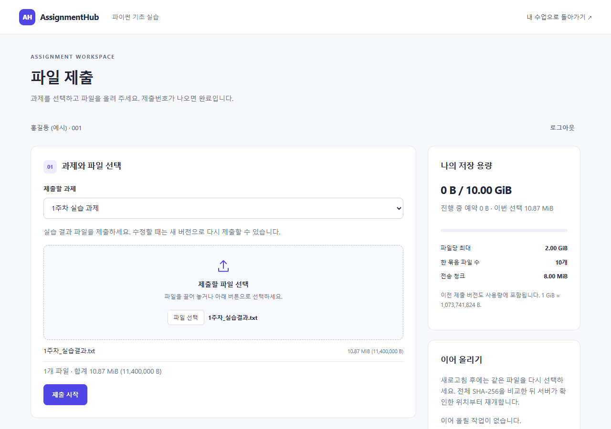

# AssignmentHub

운영자 PC에서 수강생 계정과 과제 파일을 관리하는 한국어 로컬 서버입니다. Streamlit 화면과 FastAPI 업로드 API를 Caddy의 **인스턴스별 단일 접속 포트**로 제공합니다. 과제 파일은 브라우저에서 8MiB 청크로 직접 전송하며, 전체 파일을 Streamlit 업로더에 올리지 않습니다.

기본 정책은 파일당 **2GiB = 2,147,483,648바이트**, 수강생별 보존 용량 **10GiB**, 디스크 최소 여유 **5GiB**, 한 제출 최대 **10개 파일**, 동시 청크 전송 슬롯 **4개**, 미완료 보관 **24시간**입니다. `GiB = 1,073,741,824바이트`를 일관되게 사용합니다. 모든 설정은 인스턴스별로 변경할 수 있습니다.

## 시나리오별 매뉴얼과 퀵가이드

[2쪽 퀵가이드 PDF](docs/manual/AssignmentHub_퀵가이드.pdf) · [35쪽 상세 매뉴얼 PDF](docs/manual/AssignmentHub_사용자_매뉴얼.pdf) · [편집용 PPTX](docs/manual/AssignmentHub_사용자_매뉴얼.pptx) · [시나리오별 사용 예시](docs/manual/scenarios.md)

v1.3.0의 **8자 비밀번호·차수 공통 임시비밀번호·코드 없는 제출**에 맞춰 갱신했습니다. 운영자용·수강생용 퀵가이드는 각각 한 쪽입니다. 상세 매뉴얼은 수업 준비, 첫 명단 등록, 추가 등록·그룹 변경, 비밀번호 초기화, 과제 접수, 여러 파일 제출, 이어 올리기, 수정본 재제출, 미제출자 확인, 두 과정 운영, 종료·백업·복원을 12개 시나리오로 설명합니다. [명단 예시 TSV 3종](docs/manual/README.md#tsv-예시-파일)과 인터넷 없이 열 수 있는 웹 매뉴얼을 함께 제공합니다.

현재 [v1.3.1 릴리즈](https://github.com/prozac0401/AssignmentHub/releases/tag/v1.3.1)의 프로그램과 매뉴얼·퀵가이드 첨부 파일을 사용하세요. v1.3.0 개정 매뉴얼은 v1.3.1에도 적용됩니다. v1.3.1에서는 서버 관리창의 진행 표시를 수정했습니다. 상세 기능 검증 범위는 [검증 보고서](docs/test-report.md), [진행 표시 검증](docs/v1.3.1-test-report.md), [Python 내장 배포 검증 결과](docs/portable-test-report.md)를 참고하세요.

서버 관리창과 수업·제출 화면에 공통 디자인을 적용했습니다. 창 크기에 따라 메뉴·입력란·버튼을 재배치하며 파일 드래그 앤 드롭을 지원합니다. [디자인 참고와 화면 크기 대응](docs/ui-design.md)



## 더블클릭으로 시작 — 서버 운영자

1. [**`AssignmentHub-1.3.1-windows-x64.zip`**](https://github.com/prozac0401/AssignmentHub/releases/download/v1.3.1/AssignmentHub-1.3.1-windows-x64.zip) 전체를 쓰기 가능한 폴더에 압축 해제합니다. Windows 10/11 x64용이며 Python·Tcl/Tk·라이브러리·Caddy가 모두 포함되어 있습니다.
2. 압축 해제한 폴더의 **`start.bat`를 더블클릭**합니다. 별도 설치, 관리자 권한, 인터넷 다운로드 없이 한국어 서버 관리창을 엽니다. ZIP 안에서 직접 실행하지 마세요.
3. **새 과정 만들기**에서 과정명·수강생 접속 IP·관리자 비밀번호를 입력합니다. 과정 ID와 비어 있는 포트는 제안되며, 저장 폴더를 선택할 수 있습니다. 용량은 GiB 단위로 입력합니다.
4. 과정 선택 → **서버 시작** → **관리자 화면 열기** 순서로 진행합니다. 웹 관리자 화면의 **운영 안내**에서 명단 등록·과제 설정·접속 주소 안내를 진행합니다.
5. 다음 수업부터는 관리창에서 해당 과정의 **서버 시작**만 누르면 됩니다. 수업 종료 후에는 **서버 중지**를 누릅니다.

관리창은 여러 과정의 실행 상태를 함께 표시하고 주소 복사, 기존 설정 추가, 저장·로그 폴더 열기, 접속·오류 점검을 제공합니다. 창을 닫아도 실행 중인 서버는 유지되며, 닫기 전에 이를 안내합니다. `manage.bat`도 인자 없이 더블클릭하면 같은 관리창을 엽니다.

GUI로 생성한 과정은 기본적으로 설정을 `instances/`, 데이터를 `data/<과정 ID>/`에 저장합니다. 기존에 다른 위치에 만든 과정은 **기존 설정 추가**에서 JSON을 선택합니다. 기존 DB·파일을 이동하거나 복사하지 않습니다. 네트워크 IP 후보가 여러 개이면 교육장 네트워크의 주소를 선택하세요. `127.0.0.1`은 이 PC에서만 접속할 수 있습니다.

[서버 관리창 사용 안내](docs/server-manager.md) · [관리자 운영·백업 안내](docs/admin-guide.md)

## 명령어로 실행하기

압축 해제한 배포 폴더에서 명령 프롬프트를 엽니다. `setup.bat`는 선택적인 오프라인 무결성 점검입니다. 실행 시 Python 설치나 pip 설치를 수행하지 않으며, 로그인·제출에 외부 클라우드나 CDN을 사용하지 않습니다. 수강생은 같은 네트워크의 브라우저로 접속합니다.

```bat
setup.bat
manage.bat create --config instances\course_01.json --instance-id course_01 --course-name "교육과정 1차" --port 8501 --public-host 192.168.0.10 --storage-root D:\Assignments\course_01 --admin-id admin
manage.bat start --config instances\course_01.json
manage.bat status --config instances\course_01.json
```

생성 시 로컬 콘솔에서 관리자 비밀번호를 두 번 입력합니다. 기본 비밀번호는 없습니다. 예시 IP `192.168.0.10`은 **실제 서버 PC의 교육장 네트워크 IP**로 바꾸세요. 수강생에게는 출력된 접속 URL을 안내하며 다른 PC에 `localhost`를 안내하지 않습니다. 방화벽에서 지정한 외부 포트의 교육장 네트워크 접근을 허용해야 합니다.

관리자 로그인 후 **명단 등록**에서 헤더를 포함한 TSV를 붙여넣거나 `templates/users_template.tsv`의 예시 행을 실제 수강생으로 바꾼 파일을 올립니다. 엑셀·스프레드시트의 셀 범위를 복사해 붙여넣을 수도 있습니다. 필수 열은 `user_id`, `name`이며 `group`은 선택입니다. 미리보기에서 개인별 자동 발급 또는 **신규 수강생에게 공통 임시비밀번호 사용**을 선택합니다. 임시비밀번호는 영문·숫자 8자리입니다. 공통값은 명단 등록 때 지정하며, 추가 등록 시에도 같은 값을 입력합니다. 반영 후 결과 CSV를 내려받아 각 수강생에게 전달합니다. 수강생은 최초 로그인 후 8~128자 새 비밀번호로 변경하고 다시 로그인합니다. 과제를 고른 뒤 **파일 제출·이어 올리기**를 누르면 코드 입력 없이 바로 제출할 수 있습니다.

## 두 인스턴스 동시 실행

```bat
manage.bat create --config instances\course_02.json --instance-id course_02 --course-name "교육과정 2차" --port 8502 --public-host 192.168.0.10 --storage-root D:\Assignments\course_02 --admin-id admin
manage.bat start --config instances\course_01.json
manage.bat start --config instances\course_02.json
manage.bat stop --config instances\course_01.json
manage.bat status --config instances\course_02.json
```

각 인스턴스는 별도 DB, 비밀값, 파일, 실행 잠금을 사용합니다. 같은 저장 루트를 여러 인스턴스가 공유할 수 없습니다. 내부 API·Streamlit 포트는 실행 도구가 loopback에서 자동 할당합니다. 일반 Python·Streamlit 프로세스를 일괄 종료하지 않습니다.

## 제공 기능과 주요 파일

| 경로 | 역할 |
| --- | --- |
| `assignmenthub/config.py`, `db.py`, `service.py`, `api.py` | 설정, SQLite, 인증·권한·용량·복구, API |
| `assignmenthub/ui.py`, `assignmenthub/static/` | 한국어 관리·수강생 화면, 브라우저 청크 업로더 |
| `assignmenthub/server_manager.py`, `management.py` | 한국어 로컬 관리창, 과정 생성·설정·접속 점검 |
| `assignmenthub/cli.py`, `launcher.py` | 생성·설정·시작·상태·중지, 단일 포트 게이트웨이 |
| `start.bat`, `setup.bat`, `manage.bat` | 동봉 Python으로 관리창·오프라인 점검·CLI 실행 |
| `runtime/python/`, `tools/caddy.exe` | 배포 ZIP에 포함된 독립 Python·Tcl/Tk·라이브러리·프록시 |
| `build_portable.bat`, `scripts/build_portable.py`, `requirements.lock` | 배포본 생성 및 해시 고정 의존성 |
| `examples/` | 두 인스턴스 설정 예제 |
| `templates/users_template.tsv` | ID를 텍스트로 읽는 탭 구분 사용자 등록 템플릿 |
| `tests/`, `scripts/load_test.py` | 작은 경계·장애 테스트와 실제 대용량 검증 |

명단 미리보기·재등록, 비밀번호 변경·초기화, 계정 활성화, 과제 접수 제어, 여러 파일 묶음, 재제출 버전, 이어 올리기·취소, 관리자 집계·내보내기, 권한 검사 후 스트리밍 다운로드를 제공합니다. 완료된 제출물의 자동 삭제 및 수강생 삭제, 임의 회원가입, EXE 배포는 초기 범위에 포함하지 않습니다.

## 검사와 운영 문서

소스 저장소에는 대용량 런타임 바이너리를 커밋하지 않습니다. **사용자에게는 빌드된 배포 ZIP 전체를 전달**합니다. 빌드 PC에서 `setup_dev.bat`로 개발 환경을 준비한 뒤 `build_portable.bat`를 실행하면 `dist/`에 배포 폴더, ZIP, SHA-256 파일이 만들어집니다. 빌드 PC에만 Python 3.12 x64(Tcl/Tk 포함)와 의존성 다운로드가 필요합니다. 자세한 구성·재빌드·검증 절차는 [무설치 배포 안내](docs/portable-distribution.md)를 참고하세요.

```bat
.venv\Scripts\python.exe -m pytest -q
.venv\Scripts\python.exe scripts\load_test.py --help
```

자동 테스트 통과와 실제 2GiB·브라우저 검증 여부는 구분합니다. 수행 명령, 결과, 미검증 항목은 [검증 보고서](docs/test-report.md)에 기록합니다. 실제 대용량 검증은 전용 테스트 인스턴스를 사용하세요.

- [요구사항과 기본 가정](docs/requirements.md)
- [사용자가 제공한 전체 요구사항](docs/requirements-source.md)
- [구조·인증·업로드·복구 정책](docs/architecture.md)
- [API 참조](docs/api.md)
- [관리자 운영·명단·백업·복원](docs/admin-guide.md)
- [수강생 로그인·제출·재시도](docs/user-guide.md)

백업은 `manage.bat stop --config ...` 후 중지 상태를 확인하고 **설정 파일과 저장 루트 전체**를 함께 복사합니다. DB만 복사하면 제출 파일이나 인증 비밀값이 빠질 수 있습니다. 상세 복원 절차는 관리자 문서를 따르세요. HTTP 운영에서는 네트워크 구간이 암호화되지 않습니다. 실제 개인정보를 다루는 환경은 신뢰하는 네트워크 및 TLS 구성을 적용하세요.
