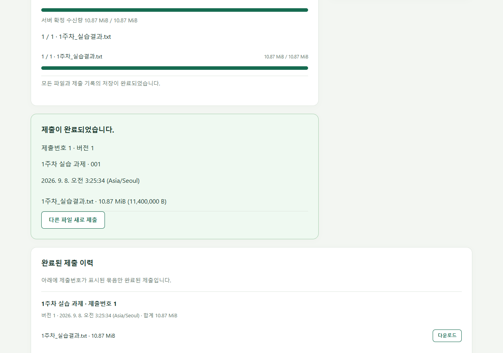
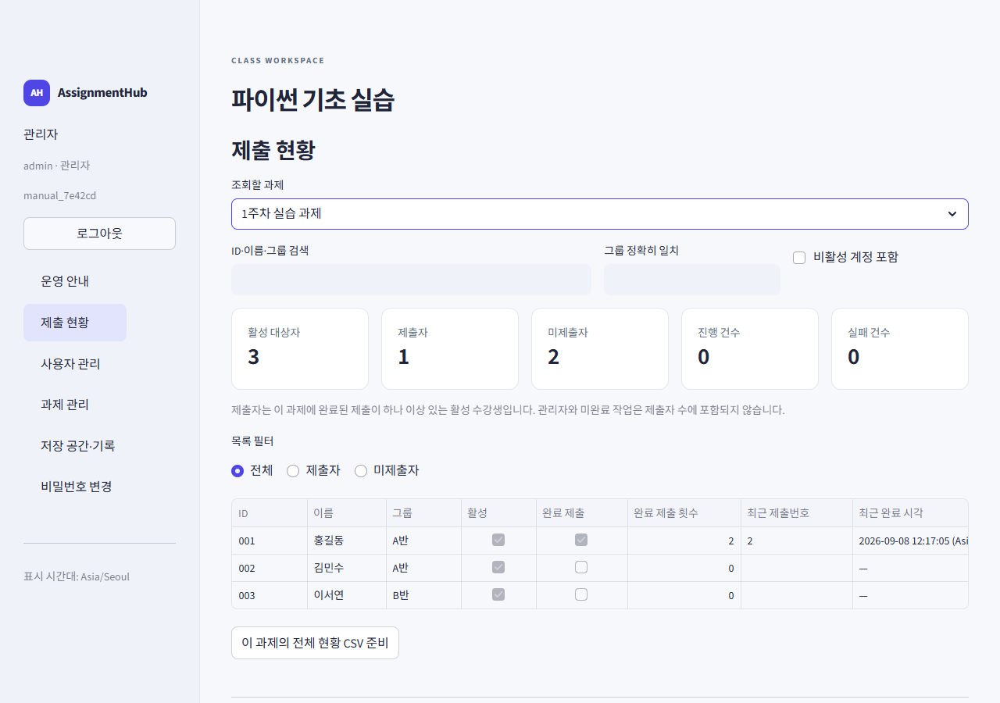

# AssignmentHub 화면 매뉴얼

[PowerPoint 매뉴얼 다운로드](AssignmentHub_사용자_매뉴얼.pptx)

**27쪽, 실제 화면 캡처 24개**로 서버 준비부터 학생의 과제 제출과 수업 종료까지 설명합니다. 설명 문구는 PowerPoint에서 편집할 수 있습니다. 작은 화면의 글자를 확인하려면 아래 원본 캡처를 열어 확대하세요.

예시는 ‘파이썬 기초 실습’ 과정, ‘1주차 실습 과제’, 학생 ID `001`, `002`입니다. 템플릿에 있는 가상 인물만 사용했으며 비밀번호 결과를 닫은 뒤 캡처했습니다. 일회용 연결 코드와 브라우저 비밀번호 입력 영역은 가렸습니다. 과정 생성 창의 비밀번호는 원래 입력창의 마스킹 상태입니다.

캡처의 `127.0.0.1`, 임의 포트, `.local-tests` 저장 경로는 재현용입니다. 실제 운영에서는 서버 PC의 교육장 네트워크 IP와 운영용 저장 폴더를 지정하세요. 예시 계정은 실제 명단으로 교체합니다.

## 실제 사용 순서

과정 설정의 두 탭은 높이가 같으며 **연보라색 배경**이 현재 탭을 나타냅니다. 탭을 선택해도 제목의 높이와 위치는 유지됩니다. PPT 3–4쪽과 기본 정보·용량 설정 캡처에 반영했습니다.

| PPT 쪽 | 사용 단계 | 화면 |
| --- | --- | --- |
| 2 | 서버 PC에서 `start.bat` 실행 | [서버 관리창](screenshots/01-manager-empty.png) |
| 3 | 새 과정과 관리자 계정 생성 | [기본 정보](screenshots/02-create-course.png) |
| 4 | 파일당 한도와 누적 용량 확인 | [용량 설정](screenshots/03-course-limits.png) |
| 5 | 서버 시작, 주소 복사 | [실행 중](screenshots/04-server-running.png) |
| 6 | 접속 문제 점검 | [진단 결과](screenshots/05-diagnostics.png) |
| 7 | 관리자 로그인 | [로그인](screenshots/06-admin-login.png) |
| 8 | 명단과 과제 준비 | [운영 안내](screenshots/07-admin-home.png) |
| 9 | 템플릿 업로드와 미리보기 | [명단 검증](screenshots/08-roster-preview.png) |
| 10 | 임시비밀번호 CSV 배포 후 결과 닫기 | [등록된 사용자](screenshots/09-users-registered.png) |
| 11 | ‘1주차 실습 과제’ 추가 | [과제 생성](screenshots/10-assignment-create.png) |
| 12 | 학생 최초 로그인 후 비밀번호 변경 | [첫 비밀번호 변경](screenshots/11-first-password.png) |
| 13 | 일회용 연결 코드 발급 | [학생 화면](screenshots/12-student-home.png) |
| 14 | 제출 창에 코드 입력 또는 같은 계정으로 로그인 | [제출 창 연결](screenshots/13-upload-connect.png) |
| 15 | 과제와 파일 선택 후 제출 시작 | [파일 선택](screenshots/14-file-selected.png) |
| 16 | 전송 중단 상태 확인 | [일시 중지](screenshots/15-upload-paused.png) |
| 17 | 재로그인 후 같은 원본으로 이어 올리기 | [이어 올리기](screenshots/16-resume-selected.png) |
| 18 | 제출번호와 완료 시각 확인 | [제출 완료](screenshots/17-submission-receipt.png) |
| 19 | 이력에서 파일 다운로드 | [나의 이력](screenshots/18-student-history.png) |
| 20 | 대상 2명, 제출 1명, 미제출 1명 확인 | [관리자 현황](screenshots/19-admin-dashboard.png) |
| 21 | 사용량과 디스크 여유 확인 | [저장 공간](screenshots/20-storage-audit.png) |
| 22 | 서버 중지 후 중지 상태 확인 | [중지된 과정](screenshots/21-server-stopped.png) |
| 23–24 | 백업과 자주 생기는 상황 | [관리자 운영 문서](../admin-guide.md) |
| 25 | 작은 관리창에서 서버 조작 | [640 × 520 관리창](screenshots/22-manager-compact.png) |
| 26 | 좁은 화면에서 파일 제출 | [390px 제출 화면](screenshots/23-upload-mobile.png) |
| 27 | 좁은 화면에서 현황 조회 | [768px 관리자 화면](screenshots/24-dashboard-tablet.png) |

## 제출 완료 예시

전송량이 100%여도 검증과 저장이 남아 있을 수 있습니다. 아래와 같이 완료 안내와 **제출번호**가 표시되어야 완료한 제출입니다.

관리자는 해당 과제를 선택해 제출 여부를 확인합니다. 여러 번 제출한 학생도 제출자 수에는 한 번만 포함합니다.

## 재현과 검증 범위

작은 화면 예시를 추가했습니다. 로그인·긴 파일명이 있는 제출 화면·관리자 현황을 360/390/600/768/1024/1440px 폭에서 열어 가로 넘침을 확인합니다. PC의 파일 드래그 앤 드롭도 실제 입력 이벤트로 확인합니다. 화면 너비별 재배치와 디자인 기준은 [UI 디자인 문서](../ui-design.md)를 참고하세요.

실제 Tk 관리창, Edge 브라우저, Caddy, Streamlit, FastAPI, SQLite를 사용했습니다. 등록할 때는 배포 엑셀 템플릿의 원본 바이트를 그대로 업로드했고, 임시비밀번호 CSV도 실제 브라우저 다운로드로 받았습니다. 11,400,000바이트 파일을 8,388,608바이트까지 전송한 뒤 두 번째 청크를 테스트 도구로 끊었습니다. 새로고침 후 재로그인하여 같은 파일로 이어 올렸고, 완료 파일을 다시 내려받아 원본 SHA-256과 비교했습니다. [실행 결과](walkthrough.json)

관리창 캡처는 테스트 프로세스에서 실제 위젯 콜백을 호출하고 그 창만 캡처했습니다. 브라우저는 Playwright로 실제 화면을 조작했습니다. 운영자 계정의 마우스를 직접 움직인 시험이나 다른 물리 PC의 교실 접속 시험으로 해석하지 마세요.

**미검증:** 다른 물리 PC의 LAN 접속, 실제 TLS 인증서 배포, 새 PC 설치, 백업 복원 훈련. PowerPoint의 슬라이드 쇼 조작이나 강의실 프로젝터 화면도 별도 검증하지 않았습니다. 이 항목들은 실제 운영 전에 해당 환경에서 확인하세요.

## 매뉴얼 유지보수

- `slides.json`: PPT의 설명 문구와 캡처 대응 관계입니다.
- `scripts/capture_manual.py`, `scripts/capture_manual.cjs`: 별도 테스트 과정을 만들고 실제 화면을 다시 캡처합니다. 이 과정은 정상 운영 데이터와 분리하며 서버를 종료한 뒤 끝납니다.
- `scripts/build_manual.mjs`: `@oai/artifact-tool`로 편집 가능한 PPTX를 생성하고 패키지·레이아웃 검사를 수행합니다.
- `scripts/render_manual_powerpoint.py`: 읽기 전용으로 PowerPoint에서 열어 슬라이드 PNG를 렌더링합니다. 사용자가 열어 둔 프레젠테이션을 닫지 않습니다.

캡처를 다시 만들 때는 가상 계정만 사용하고 인증 코드나 임시비밀번호가 새 이미지에 노출되지 않았는지 확인하세요. 테스트 설정, 계정 DB, 다운로드한 비밀번호 CSV는 Git에 추가하지 않습니다. 캡처 도구에 필요한 Pillow·Playwright·pywin32와 PowerPoint는 서버 실행에 필요한 의존성이 아닙니다.
