# AssignmentHub v1.2.0 시나리오별 사용 예시

Python 내장 무설치 배포와 TSV 명단 입력을 기준으로 작성했습니다. 예시 인물과 수업은 모두 가상입니다.

[상세 PDF](AssignmentHub_사용자_매뉴얼.pdf) · [편집용 PPTX](AssignmentHub_사용자_매뉴얼.pptx) · [2쪽 퀵가이드](AssignmentHub_퀵가이드.pdf)

캡처의 `127.0.0.1`과 임시 포트·경로는 재현용입니다. 교육장에서는 실제 서버의 네트워크 IP와 운영용 저장 폴더를 지정합니다.

## 01. 처음 수업 준비

**담당:** 운영자 / 상세 매뉴얼 3~7쪽

**상황:** 처음 사용하는 운영자가 파이썬 기초 실습 과정을 열고 수강생의 접속을 준비합니다.

### 01. 배포 ZIP과 첫 실행

1. **다운로드와 압축 해제**: v1.2.0의 Windows x64 배포 ZIP 전체를 쓰기 가능한 폴더에 풉니다. Python과 라이브러리가 포함되어 있습니다.
2. **관리창 실행**: 폴더 안의 start.bat를 더블클릭합니다. 관리창이 열리면 새 과정 만들기를 선택합니다.

> ZIP 내부에서 직접 실행하지 마세요. setup.bat는 선택적인 오프라인 점검이며 설치 도구가 아닙니다.

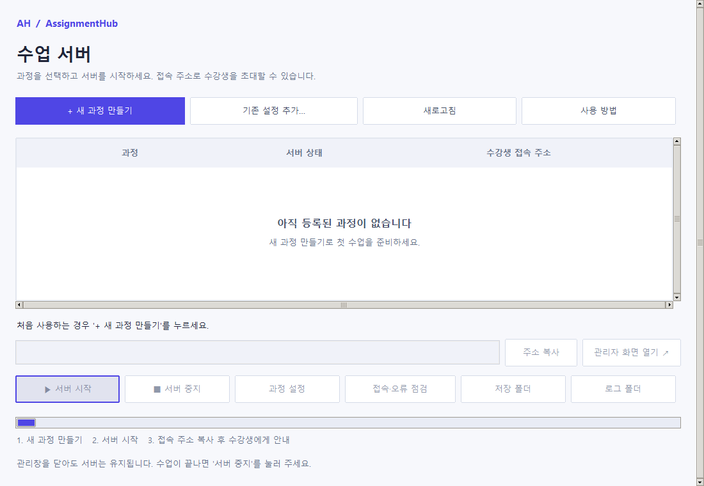

### 새 과정과 관리자 계정

1. **수업 예시**: 과정명은 파이썬 기초 실습으로 입력합니다. 안내 IP는 실제 서버 PC의 교육장 네트워크 주소를 선택합니다.
2. **저장 위치와 계정**: 과정 ID·포트·저장 폴더를 확인합니다. 관리자 ID와 12~128자의 비밀번호를 정하고 확인란에도 입력합니다.

> 캡처의 127.0.0.1과 임시 경로는 예시입니다. 다른 PC에는 실제 서버의 IP와 포트를 안내합니다.

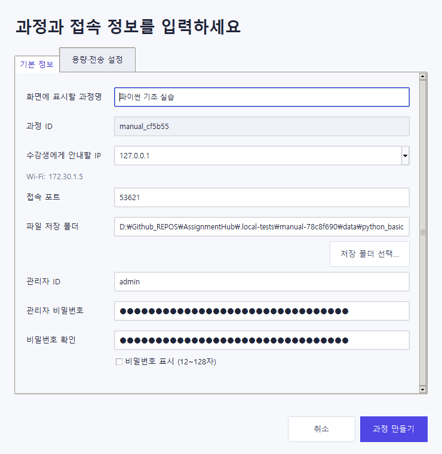

### 용량과 전송 설정

1. **기본값 확인**: 파일당 2 GiB, 수강생별 누적 10 GiB, 디스크 최소 여유 5 GiB입니다. 한 번에 최대 10개 파일을 제출합니다.
2. **과정 생성**: 용량·전송 설정을 확인한 뒤 과정 만들기를 누릅니다. 다음 수업부터는 저장된 과정을 선택하면 됩니다.

> 누적 사용량에는 다른 과제와 이전 제출 버전도 포함합니다. 기존 파일은 한도를 낮춰도 삭제되지 않습니다.

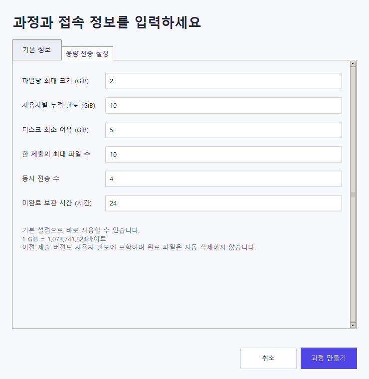

### 서버 시작과 주소 안내

1. **실행 중 확인**: 과정을 선택하고 서버 시작을 누릅니다. 상태가 실행 중이 되면 관리자 화면 열기를 선택합니다.
2. **수강생 접속 확인**: 주소 복사로 URL을 전달합니다. 예: http://192.168.0.10:8501. 수강생 PC에서도 같은 주소가 열리는지 확인합니다.

> 예시 IP를 그대로 쓰지 말고 실제 주소로 바꾸세요. 관리창을 닫아도 서버는 계속 실행됩니다.


### 관리자의 수업 준비

1. **관리자 로그인**: 과정을 만들 때 정한 관리자 계정으로 로그인합니다. 운영 안내에서 수강생 명단 등록으로 이동합니다.
2. **준비 완료 기준**: 명단이 등록되고 수업에 사용할 과제가 접수 중인지 확인합니다. 학생에게 접속 주소와 본인의 계정을 안내합니다.

> 학생별 임시비밀번호를 전체 공지에 올리지 말고 해당 학생에게 전달합니다.

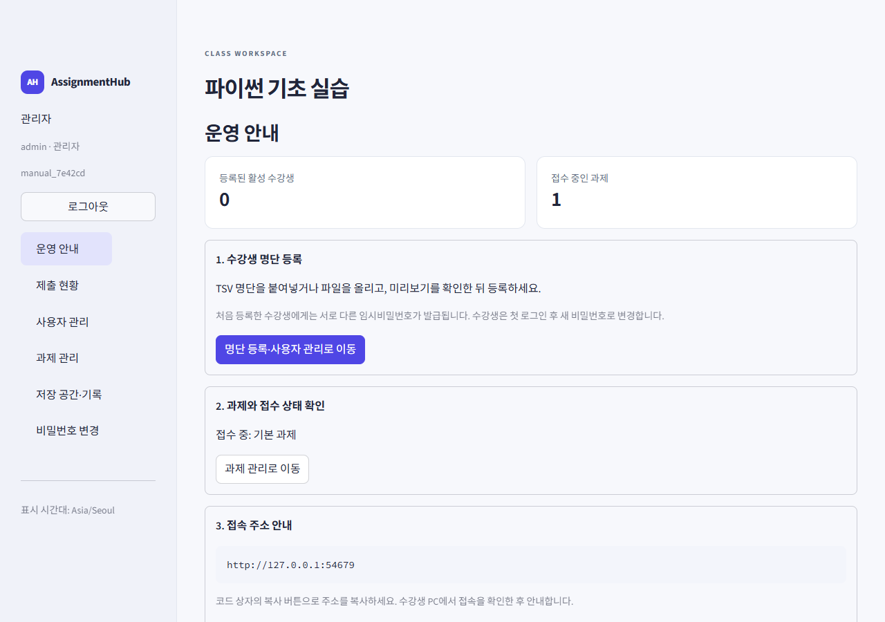

**완료 확인:** 서버 관리창에서 실행 중을 확인하고, 관리자 로그인과 실제 수강생 PC의 접속을 확인합니다.

## 02. TSV 명단 등록

**담당:** 운영자 / 상세 매뉴얼 8~11쪽

**상황:** 001 홍길동 A반과 002 김민수 B반을 처음 등록합니다. 명단은 직접 붙여넣거나 파일로 입력합니다.

[예시 파일 다운로드: 01-first-roster.tsv](examples/01-first-roster.tsv)

```tsv
user_id	name	group
001	홍길동	A반
002	김민수	B반
```

[예시 파일 다운로드: 03-duplicate-error.tsv](examples/03-duplicate-error.tsv)

```tsv
user_id	name	group
001	홍길동	A반
001	김민수	B반
```

### 02. TSV 명단 붙여넣기

1. **첫 명단 예시**: user_id, name, group 헤더와 001 홍길동 A반, 002 김민수 B반을 탭으로 구분해 붙여넣습니다.
2. **미리보기와 반영**: 명단 검증 및 미리보기를 누릅니다. 오류가 없고 ID·이름·그룹이 맞으면 검증된 명단 반영을 누릅니다.

> user_id와 name은 필수, group은 선택입니다. 엑셀에서 헤더를 포함한 셀 범위를 복사해도 됩니다.

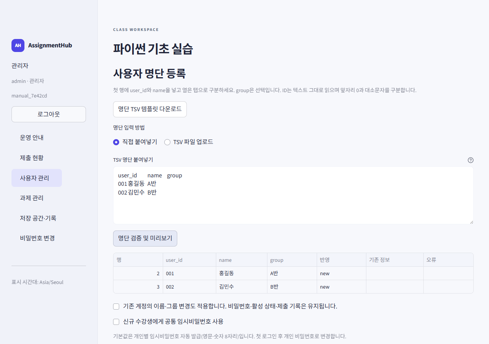

### TSV 파일로 명단 등록

1. **파일 작성**: 명단 TSV 템플릿을 내려받거나 동봉한 01-first-roster.tsv를 수정합니다. ID는 001처럼 텍스트 그대로 작성합니다.
2. **파일 업로드**: TSV 파일 업로드를 선택하고 .tsv 또는 .txt 파일을 올립니다. 검증 후 미리보기를 확인해 반영합니다.

> UTF-8 또는 BOM이 있는 UTF-16을 지원합니다. 최대 5 MiB, 10,000명, 30열입니다.

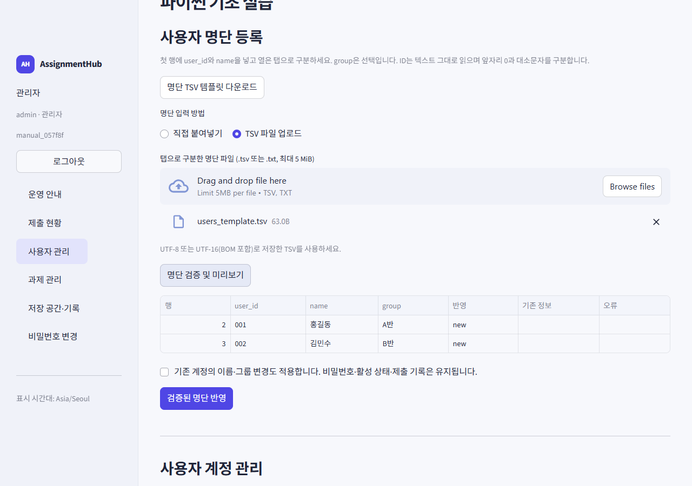

### 중복 명단 오류 수정

1. **오류 예시**: 001을 서로 다른 두 사람에게 입력하면 중복 ID 오류가 표시됩니다. 검증된 명단 반영은 사용할 수 없습니다.
2. **수정 후 재검증**: 두 번째 ID를 002로 고친 뒤 다시 검증합니다. 입력 내용이나 입력 방법이 바뀌면 이전 미리보기는 해제됩니다.

> 엑셀에서 이미 숫자로 바뀌어 사라진 0은 복원하지 않습니다. 001과 1은 서로 다른 계정입니다.

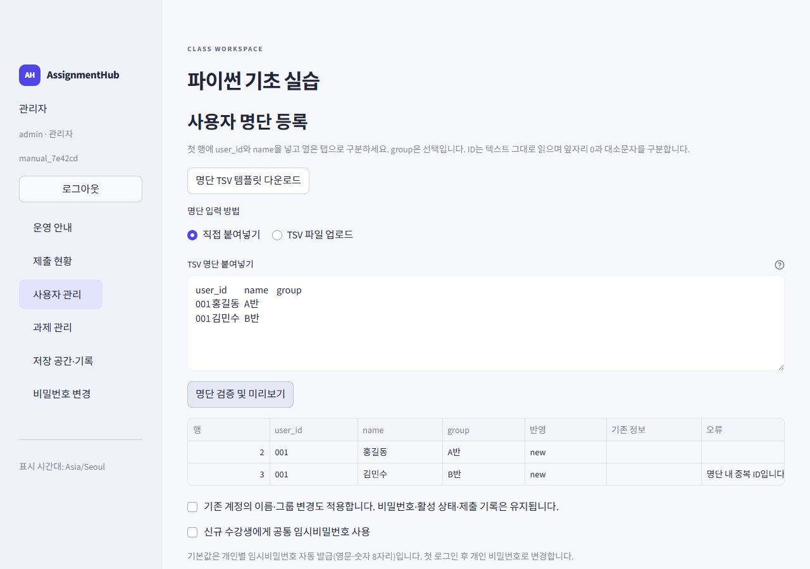

### 임시비밀번호 전달

1. **신규 계정 확인**: 반영 직후 신규 사용자의 임시비밀번호가 표시됩니다. 임시비밀번호 결과 CSV를 내려받아 학생별로 전달합니다.
2. **결과 닫기**: 전달을 마치면 임시비밀번호 결과 닫기를 누릅니다. 화면 예시는 결과를 닫은 뒤의 사용자 목록입니다.

> 명단 입력은 TSV입니다. 비밀번호와 현황의 내보내기 파일은 CSV이며, 초기 비밀번호는 다시 조회할 수 없습니다.

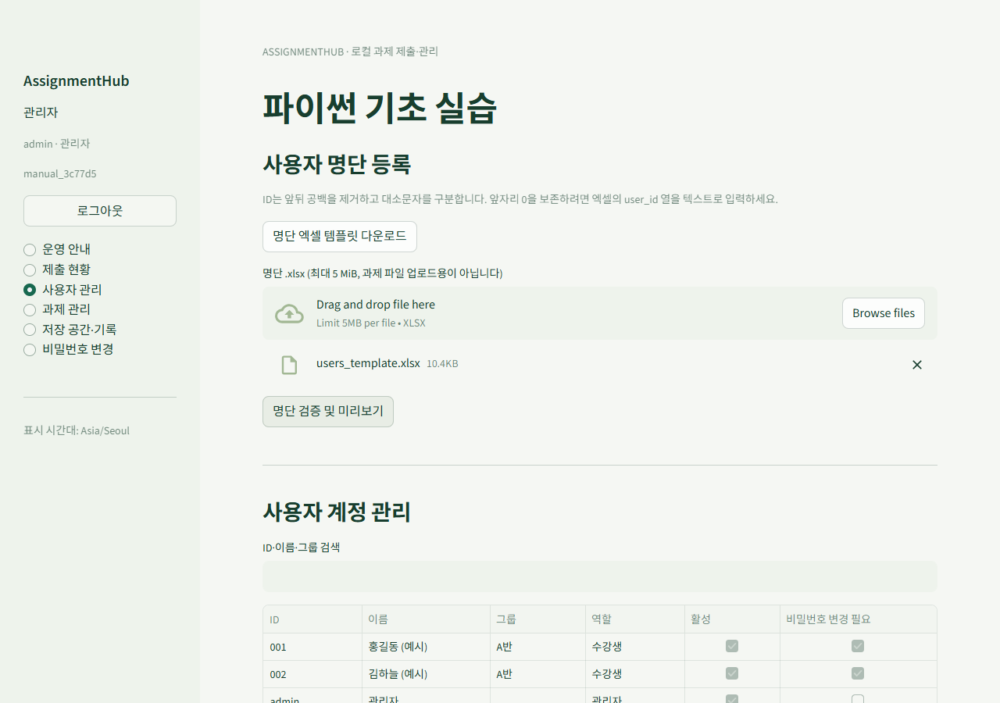

**완료 확인:** 두 계정의 ID와 그룹이 정확히 등록되고 각 학생에게 본인의 임시비밀번호를 전달합니다.

## 03. 추가 등록·그룹 변경·초기화

**담당:** 운영자 / 상세 매뉴얼 12~13쪽

**상황:** 002의 그룹을 A반으로 옮기고, 뒤늦게 합류한 003 이서연을 B반에 추가합니다. 비밀번호 분실 시의 초기화 절차도 확인합니다.

[예시 파일 다운로드: 02-add-and-update.tsv](examples/02-add-and-update.tsv)

```tsv
user_id	name	group
002	김민수	A반
003	이서연	B반
```

### 03. 추가 등록과 그룹 변경

1. **변경 명단 예시**: 002 김민수를 B반에서 A반으로 옮기고, 003 이서연을 B반에 추가합니다. 두 행만 TSV로 입력해 검증합니다.
2. **기존 정보 갱신**: 기존 계정의 이름·그룹 변경도 적용 옵션을 선택하고 반영합니다. 신규 1명 등록과 기존 1명 변경을 확인합니다.

> 기존 비밀번호·활성 상태·제출은 유지합니다. 이번 TSV에 없는 기존 계정을 삭제하거나 비활성화하지 않습니다.

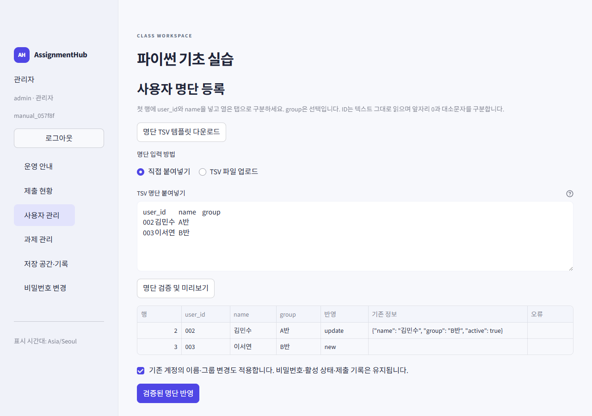

### 비밀번호를 잊은 수강생

1. **대상 확인**: 사용자 관리에서 ID 002를 검색하고 관리할 수강생을 확인합니다. 기존 권한 무효화 안내에 체크합니다.
2. **초기화와 재로그인**: 비밀번호 초기화를 눌러 새 임시비밀번호를 해당 학생에게 전달합니다. 학생은 새 비밀번호로 변경 후 다시 로그인합니다.

> 초기화는 기존 로그인·업로드 권한을 즉시 무효화합니다. 완료된 제출 파일과 이력은 유지합니다.

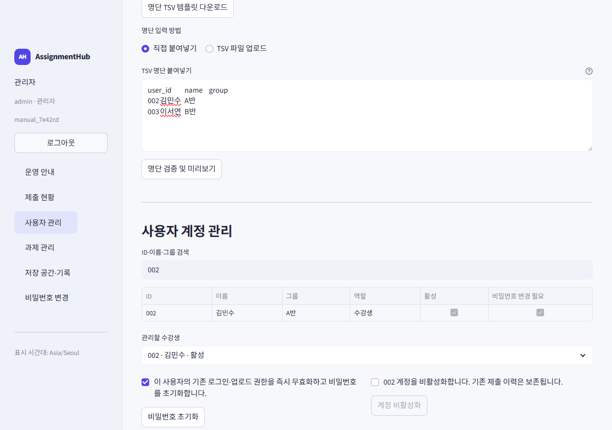

**완료 확인:** 기존 계정의 이력을 유지하면서 1명 추가와 1명 변경을 확인합니다. 초기화한 학생은 새 임시비밀번호로 비밀번호를 변경합니다.

## 04. 과제 생성과 접수 종료

**담당:** 운영자 / 상세 매뉴얼 14~15쪽

**상황:** 1주차 실습 과제를 만들고 파일 접수를 시작합니다. 수업이 끝나면 같은 과제의 신규 접수를 닫습니다.

### 04. 과제 생성과 접수 시작

1. **과제 작성**: 과제 관리에서 새 과제 추가를 펼칩니다. 제목은 1주차 실습 과제, 설명에는 제출할 파일과 수정본 처리 방법을 적습니다.
2. **접수 시작**: 즉시 접수 시작을 확인하고 과제 추가를 누릅니다. 학생에게 여러 과제 중 선택할 정확한 제목을 안내합니다.

> 처음 생성된 기본 과제를 수정해 사용해도 됩니다. 여기서는 별도 과제를 추가하는 상황입니다.

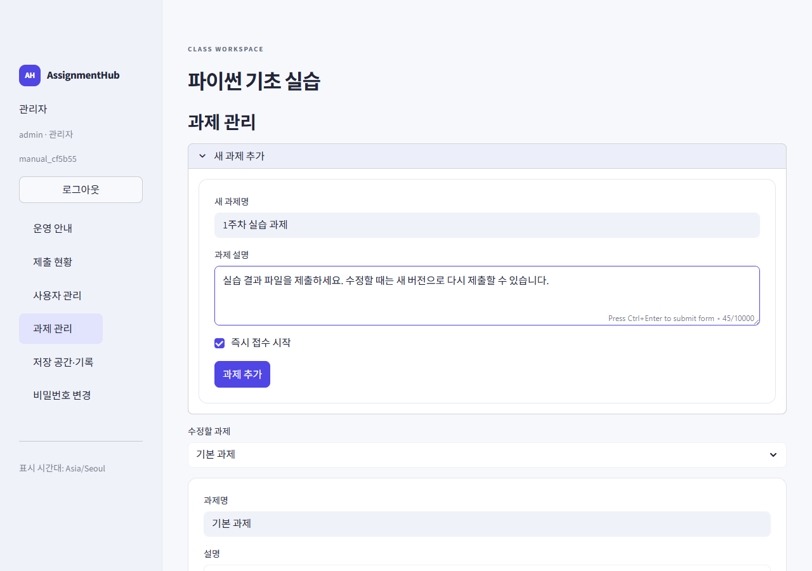

### 과제 접수 종료

1. **마감 예시**: 수업 종료 시 과제 관리에서 1주차 실습 과제를 선택합니다. 접수 중을 해제하고 변경 사항 저장을 누릅니다.
2. **종료의 범위**: 이후 신규 제출 시작을 막습니다. 종료 전에 시작한 유효한 업로드는 보관 시간 내에 완료할 수 있습니다.

> 즉시 모든 전송을 멈춰야 한다면 학생에게 안내하고 서버를 중지합니다. 접수 종료만으로 기존 전송을 끊지 않습니다.

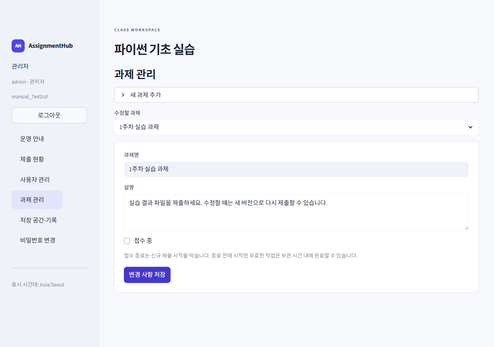

**완료 확인:** 학생에게 안내한 과제가 접수 중으로 보이고, 마감 후에는 신규 제출을 시작할 수 없습니다. 기존 진행 작업의 완료 가능 여부를 별도로 안내합니다.

## 05. 첫 로그인과 제출 창 연결

**담당:** 수강생 / 상세 매뉴얼 16~18쪽

**상황:** 학생 001이 전달받은 계정으로 처음 로그인하고 파일 제출 창에 연결합니다.

### 05. 학생의 첫 로그인

1. **받은 계정 입력**: 서버 주소를 열고 ID 001과 본인의 임시비밀번호로 로그인합니다. ID의 앞자리 0과 대소문자를 그대로 입력합니다.
2. **비밀번호 변경**: 현재 임시비밀번호와 새로운 12~128자 비밀번호를 입력합니다. 변경을 마치고 새 비밀번호로 다시 로그인합니다.

> 첫 비밀번호 변경을 마쳐야 과제를 조회하고 파일을 제출할 수 있습니다.

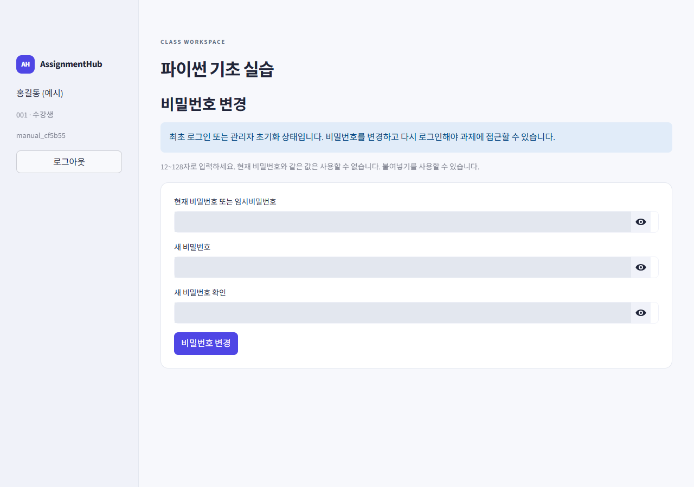

### 파일 제출 화면 연결

1. **연결 코드 사용**: 일회용 연결 코드 발급을 눌러 코드를 복사합니다. 파일 제출·이어 올리기 화면 열기로 제출 창을 엽니다.
2. **접속 계정 확인**: 제출 창에서 코드로 연결합니다. 연결 후 표시된 ID가 본인의 ID인지 확인합니다.

> 코드는 짧은 시간 동안 한 번만 사용합니다. 예시 화면의 코드 영역은 가렸습니다.

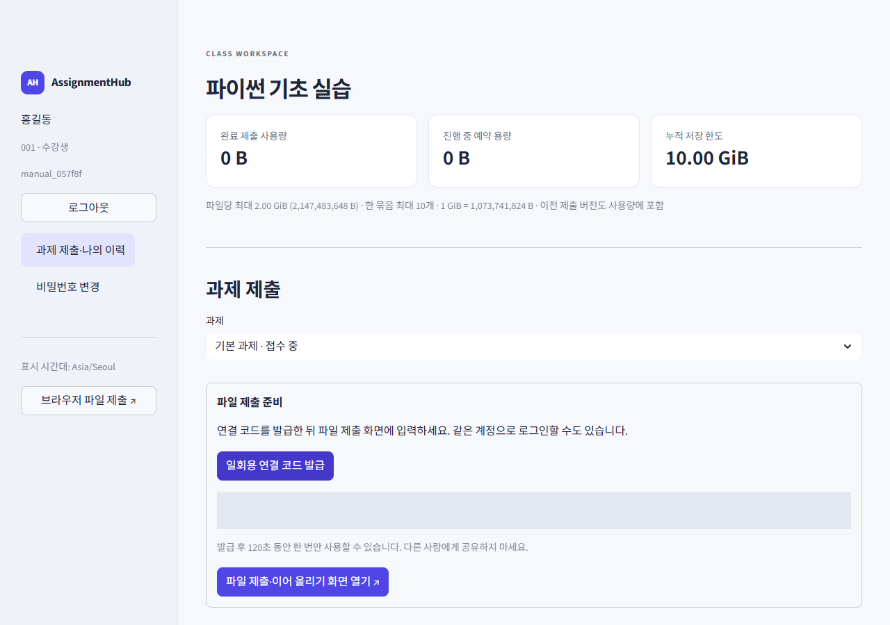

### 제출 창에서 직접 로그인

1. **코드가 만료된 경우**: 새 연결 코드를 받거나 제출 창의 ID와 비밀번호로 로그인합니다. 비밀번호는 처음 변경한 새 비밀번호입니다.
2. **다시 연 창**: 새로고침이나 브라우저 재실행 후에도 본인 계정으로 로그인할 수 있습니다. 이어 올릴 작업은 로그인 후 선택합니다.

> 다른 사람의 계정으로 제출하면 그 계정의 이력에 남습니다. 본인 계정과 과제명을 확인하세요.

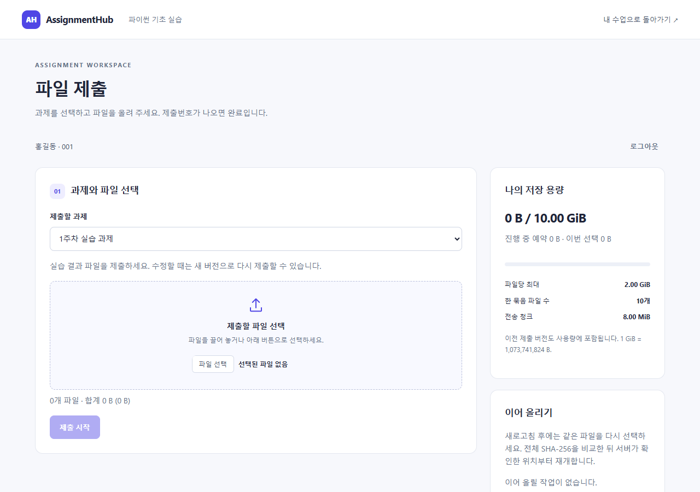

**완료 확인:** 첫 비밀번호 변경과 재로그인을 마친 뒤, 제출 창에 본인의 ID가 표시됩니다.

## 06. 여러 파일 제출과 완료 확인

**담당:** 수강생 / 상세 매뉴얼 19~20쪽

**상황:** 학생 001이 1주차_실습결과.txt와 제출_설명.txt를 하나의 묶음으로 제출합니다.

### 06. 여러 파일을 한 번에 제출

1. **파일 선택 예시**: 1주차 실습 과제를 선택하고 1주차_실습결과.txt와 제출_설명.txt를 함께 선택합니다. PC에서는 끌어 놓기도 가능합니다.
2. **전송 시작**: 파일명·개수·총용량과 내 저장 공간을 확인합니다. 제출 시작을 누르고 전송·검증·저장 상태를 기다립니다.

> 파일 선택만으로 전송되지 않습니다. 여러 파일은 하나의 묶음으로, 모두 끝나야 완료 제출로 집계됩니다.


### 제출 완료와 제출번호

1. **완료 기준**: 제출이 완료되었습니다 안내와 제출번호가 나타나는지 확인합니다. 100% 진행률만으로 제출 완료를 판단하지 않습니다.
2. **내역 확인**: 과제명, ID, 파일 목록, 버전과 서버 완료 시각을 확인합니다. 문의할 때 제출번호를 함께 알려 주세요.

> 제출 이력에서 파일을 다운로드해 서버에 저장된 내용을 확인할 수 있습니다.


**완료 확인:** 두 파일 모두 검증·저장을 마치고 제출번호와 버전 1이 표시됩니다. 내려받은 파일 내용이 원본과 같은지 확인할 수 있습니다.

## 07. 중단 후 이어 올리기

**담당:** 수강생 / 상세 매뉴얼 21~22쪽

**상황:** 전송 도중 연결이 끊기고 브라우저를 새로고침했습니다. 처음 선택한 두 원본 파일은 수정하지 않은 상태입니다.

### 07. 전송 도중 연결이 끊긴 경우

1. **중단 상황**: 예시는 첫 파일의 일부가 서버에 저장된 뒤 전송이 중단된 상태입니다. 원본 파일을 수정하지 않고 보관합니다.
2. **같은 창에서 재시도**: 네트워크가 복구되면 다시 시도를 누릅니다. 계속 실패하면 관리자에게 접속 상태와 남은 공간을 확인해 달라고 요청합니다.

> 서버가 확정한 수신량부터 이어 올립니다. 완료 전의 작업은 제출자 수에 포함되지 않습니다.

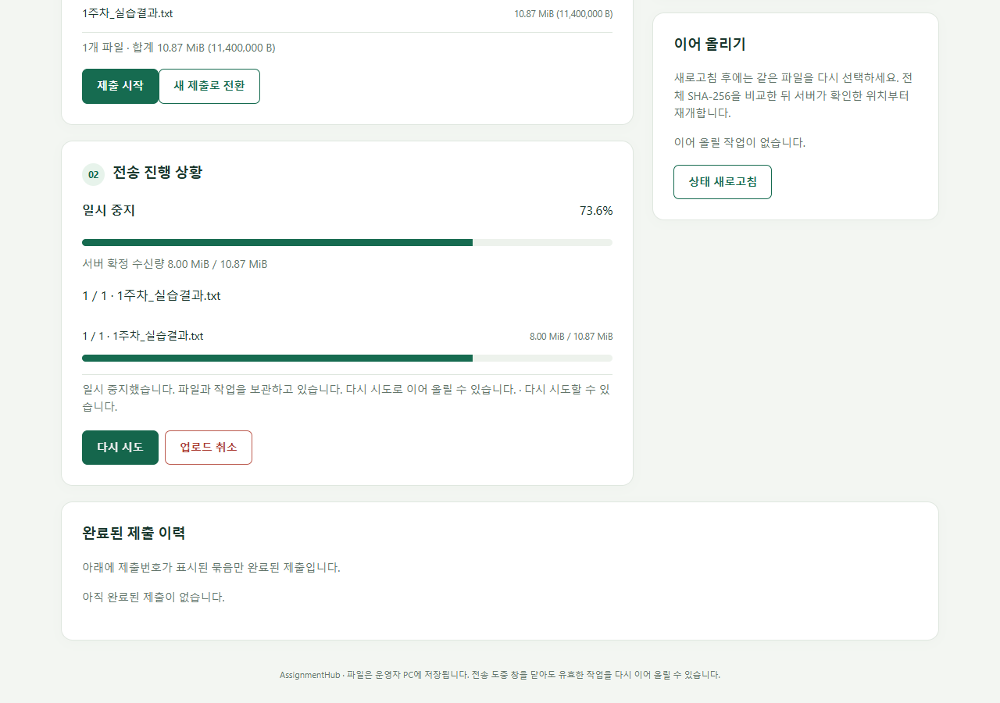

### 새로고침 후 이어 올리기

1. **미완료 작업 선택**: 다시 로그인하고 이어 올리기에서 이 작업 이어 올리기를 누릅니다. 좁은 화면에서는 아래로 스크롤합니다.
2. **동일 원본 다시 선택**: 처음의 두 파일을 모두 다시 선택하고 확인 후 이어 올리기를 누릅니다. 서버가 확인한 지점부터 전송을 계속합니다.

> 이름·크기·내용이 같은 원본이어야 합니다. 수정한 파일은 미완료 작업을 취소하고 새로 제출합니다.

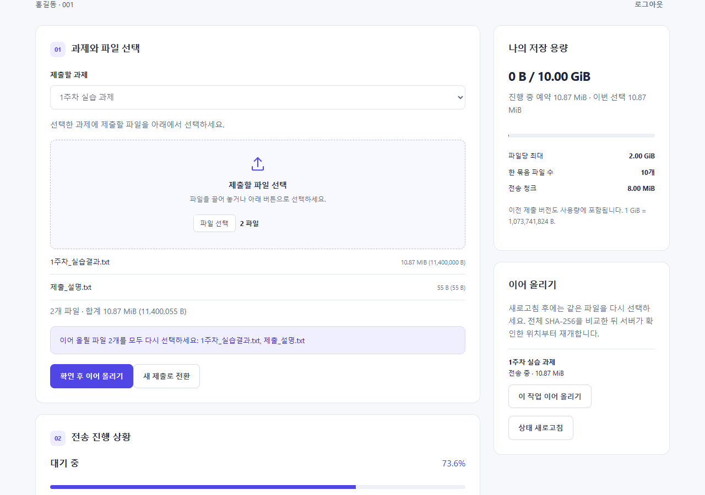

**완료 확인:** 기존 미완료 작업을 선택한 뒤 동일 원본으로 이어 올려 제출번호를 확인합니다. 원본이 달라졌다면 기존 작업을 취소하고 새 제출을 시작합니다.

## 08. 수정본 재제출

**담당:** 수강생 / 상세 매뉴얼 23~24쪽

**상황:** 완료한 실습 결과를 수정해 1주차_실습결과_수정본.txt를 같은 과제에 다시 제출합니다.

### 08. 제출한 파일의 수정본 등록

1. **새 제출 선택**: 이미 완료한 파일을 수정했다면 다른 파일 새로 제출을 누릅니다. 같은 과제를 선택하고 수정본 파일을 고릅니다.
2. **새 버전 확인**: 제출 시작을 누른 뒤 새로운 제출번호와 버전 2를 확인합니다. 이전에 완료한 버전 1은 보존됩니다.

> 수정본을 기존 미완료 작업에 이어 붙이지 않습니다. 예시는 1주차_실습결과_수정본.txt를 새로 제출합니다.

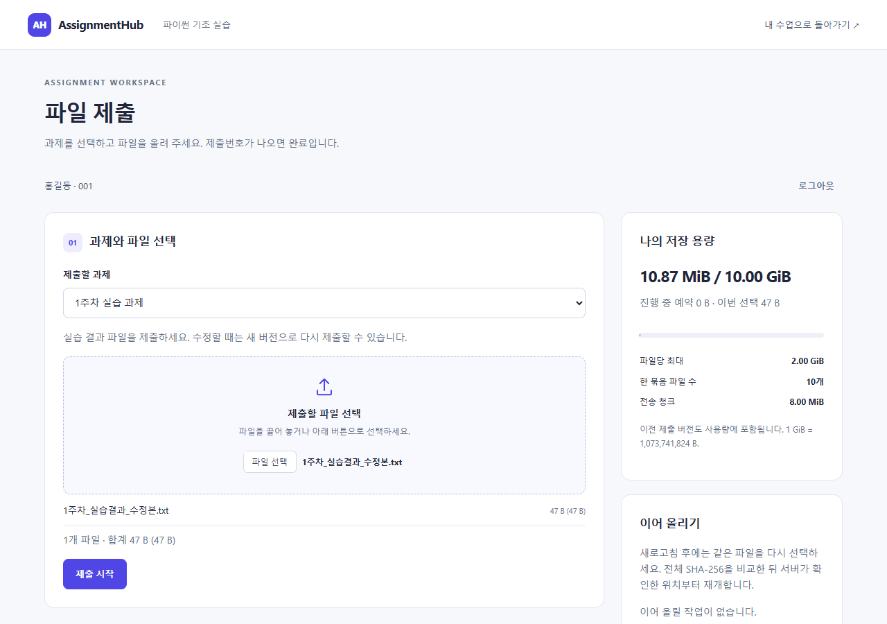

### 최신 파일과 이전 버전

1. **이력 비교**: 완료된 제출 이력에서 버전 2와 버전 1을 확인합니다. 각 묶음의 파일 목록과 완료 시각을 비교할 수 있습니다.
2. **필요한 파일 다운로드**: 원하는 버전의 다운로드를 누릅니다. 새 제출이 실패하더라도 이전 완료 제출은 계속 남아 있습니다.

> 이전 버전도 학생의 누적 저장 용량에 포함됩니다. 같은 파일명도 제출 버전마다 따로 보존합니다.

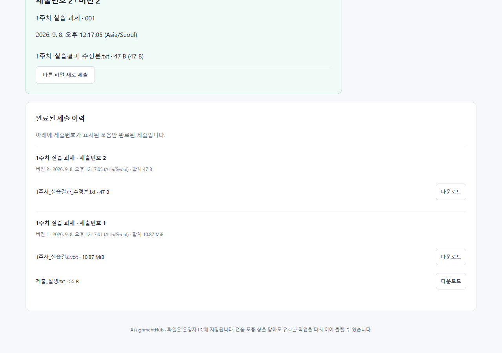

**완료 확인:** 새 제출번호와 버전 2를 확인합니다. 완료된 제출 이력에 버전 1과 2가 모두 남아 있습니다.

## 09. 미제출자·파일·용량 확인

**담당:** 운영자 / 상세 매뉴얼 25~28쪽

**상황:** 운영자가 활성 수강생 3명의 제출 여부를 확인합니다. 001은 두 번 제출했고 002와 003은 아직 완료 제출이 없습니다.

### 09. 관리자 제출 현황 확인

1. **수업의 제출 현황**: 조회할 과제로 1주차 실습 과제를 선택합니다. 예시는 활성 3명 중 001만 두 번 제출한 상태입니다.
2. **집계 해석**: 제출자는 1명, 미제출자는 2명입니다. 같은 학생이 여러 번 제출해도 제출자 수는 한 명으로 계산합니다.

> 관리자와 미완료 작업은 제출자 수에 포함하지 않습니다. 완료된 제출을 기준으로 확인합니다.


### 미제출자와 그룹 확인

1. **미제출자 조회**: 목록 필터에서 미제출자를 선택합니다. 예시에서는 002와 003에게 제출 여부를 확인하면 됩니다.
2. **그룹별 확인**: 그룹 정확히 일치에 A반을 입력하면 해당 그룹을 조회합니다. 비활성 계정 기록은 포함 옵션을 켜서 확인합니다.

> 검색·그룹 조건이 적용된 현황과 전체 현황 CSV의 범위를 구분하세요.

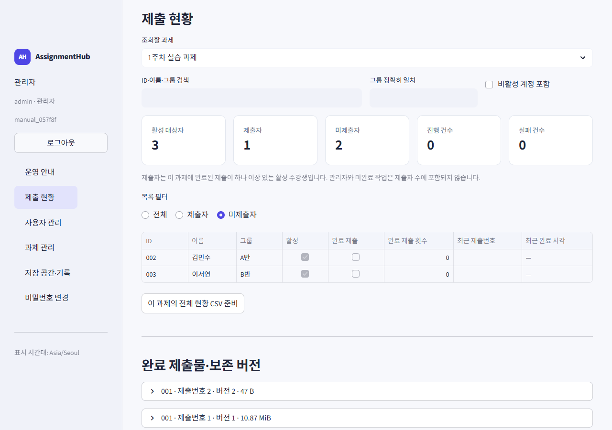

### 파일 확인과 현황 내보내기

1. **완료 제출물 확인**: 원하는 제출번호를 펼쳐 파일명·용량·버전을 확인합니다. 다운로드 준비를 누른 뒤 파일 다운로드를 선택합니다.
2. **CSV 내보내기**: 이 과제의 전체 현황 CSV 준비를 누르고 다운로드합니다. 이 파일은 화면 필터와 관계없이 해당 과제의 전체 현황입니다.

> 명단을 넣을 때는 TSV, 결과를 내보낼 때는 CSV를 사용합니다. 학생별 계정 정보를 포함한 파일은 관리자가 보관합니다.

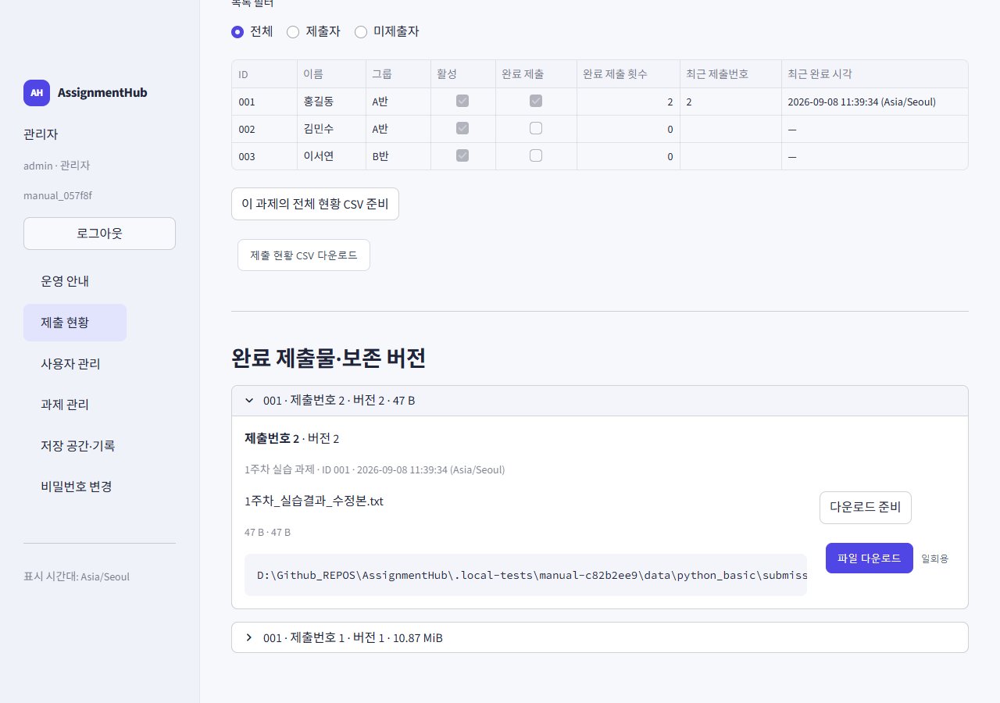

### 저장 공간이 부족한 경우

1. **항목별 확인**: 저장 공간·기록에서 완료 사용량, 예약 용량, 임시 파일 실사용량과 볼륨 잔여 공간을 확인합니다.
2. **공간 확보**: 학생이 불필요한 미완료 작업을 취소하게 하거나 서버 볼륨의 공간을 확보합니다. 한도 변경은 해당 서버를 중지한 뒤 진행합니다.

> 완료 제출 파일은 자동 삭제하지 않습니다. 데이터 폴더 안의 파일을 임의로 지우지 마세요.

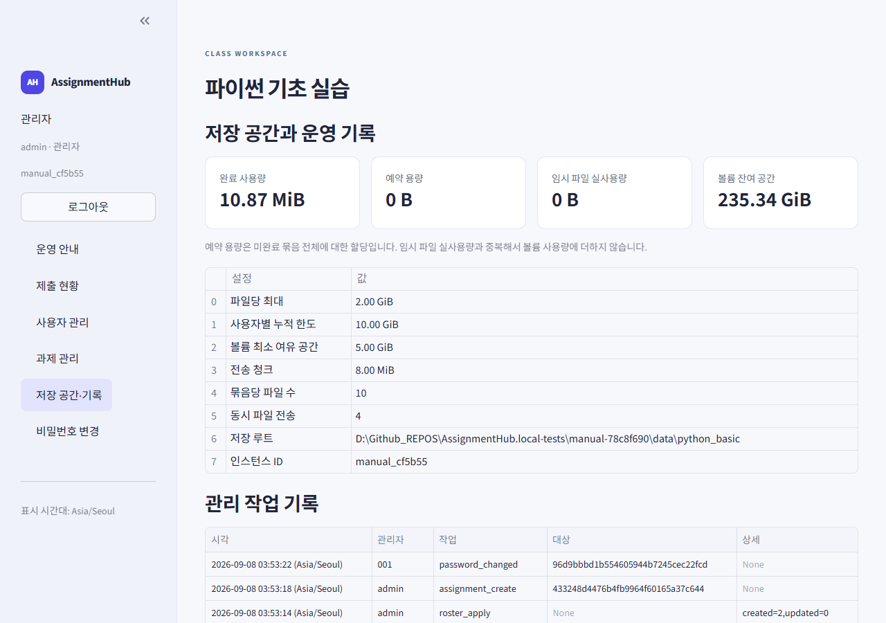

**완료 확인:** 제출자 1명과 미제출자 2명을 확인합니다. 원하는 버전의 파일과 해당 과제 전체 현황 CSV를 내려받습니다.

## 10. 두 수업 동시 운영

**담당:** 운영자 / 상세 매뉴얼 29쪽

**상황:** 한 PC에서 파이썬 기초 실습과 데이터 분석 오후반을 별도 과정으로 운영합니다.

### 10. 두 수업을 동시에 운영

1. **오전반과 오후반**: 파이썬 기초 실습과 데이터 분석 오후반을 별도 과정으로 만듭니다. 각 과정의 ID·포트·저장 폴더를 다르게 정합니다.
2. **수업별 주소 안내**: 두 과정을 시작하고 각각의 URL을 안내합니다. 한 과정의 서버를 중지해도 다른 과정은 계속 실행됩니다.

> 계정과 제출물은 과정별로 분리됩니다. 같은 학생 ID가 있어도 다른 과정의 계정으로 자동 로그인되지 않습니다.

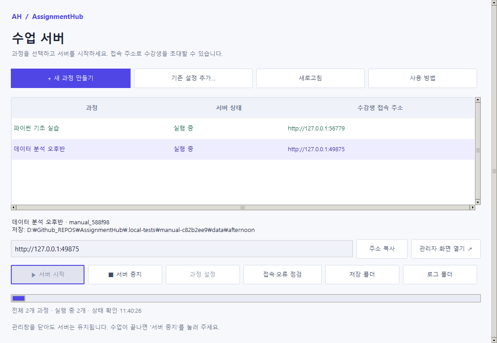

**완료 확인:** 서로 다른 포트·저장 폴더로 두 과정을 실행하고, 한 과정을 중지해도 다른 과정이 계속 실행되는지 확인합니다.

## 11. 종료·백업·복원

**담당:** 운영자 / 상세 매뉴얼 30~32쪽

**상황:** 하루 수업을 마친 운영자가 서버를 중지하고 설정과 데이터를 날짜별로 백업합니다. 복원은 별도 빈 폴더에서 진행하는 예시입니다.

### 11. 수업 종료와 서버 중지

1. **접수와 작업 마무리**: 과제 접수를 종료하고 진행 중인 학생의 완료를 기다리거나 중단 시간을 안내합니다. 제출 현황을 확인합니다.
2. **중지 상태 확인**: 서버 관리창에서 해당 과정을 선택하고 서버 중지를 누릅니다. 목록에서 중지 상태를 확인한 뒤 백업합니다.

> 관리창을 닫는 것만으로 서버가 중지되지 않습니다. 다음 수업에는 같은 과정을 다시 시작합니다.

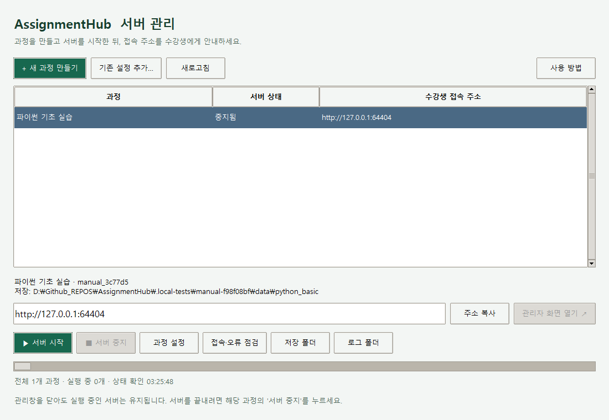

### 설정과 데이터의 백업

1. **1. 백업 시점**: 해당 과정의 서버가 중지된 뒤 복사합니다. 예: 2026-09-08 수업 종료 후.
2. **2. 함께 복사**: instances의 과정 설정 JSON과 설정에 지정한 storage_root 폴더 전체를 같은 시점으로 복사합니다.
3. **3. 보관 예시**: E:\AH_Backup\2026-09-08\ 아래에 config와 data 폴더를 만들어 보관합니다. 운영 데이터는 덮어쓰지 않습니다.
4. **4. 포함할 정보**: DB, 인증 비밀값, 제출물, 임시 파일과 로그를 함께 보관합니다. DB만 복사하면 파일과 이력을 온전히 복구할 수 없습니다.

> 정확한 설정 경로와 저장 폴더는 과정 설정에서 확인합니다. 백업에는 계정 정보가 있으므로 접근을 제한합니다.

### 별도 폴더로 복원하는 경우

1. **1. 빈 위치에 복원**: 원본과 복원 대상 서버를 중지하고 별도 빈 폴더에 설정과 데이터 전체를 복원합니다.
2. **2. 경로 확인**: 설정 JSON의 storage_root는 절대 경로입니다. 복원한 실제 폴더로 맞추고 안내 IP·포트를 확인합니다.
3. **3. 기존 설정 추가**: 관리창의 기존 설정 추가로 복원한 JSON을 선택합니다. 같은 과정 ID는 중복 등록하지 않도록 별도 배포 폴더를 사용합니다.
4. **4. 접수 전 확인**: 서버를 시작해 로그인, 제출 목록, 대표 파일 다운로드를 확인합니다. 파일 크기·해시가 맞는지 확인한 뒤 접수를 엽니다.

> 이전 운영 서버와 복원 서버가 같은 저장 폴더를 동시에 사용하면 안 됩니다. 상세 절차는 관리자 운영 안내를 참고하세요.

**완료 확인:** 중지 상태에서 설정 JSON과 저장 폴더 전체를 같은 시점으로 복사합니다. 복원 후에는 로그인·제출 목록·대표 파일의 크기와 해시를 확인한 뒤 접수를 엽니다.

## 12. 접속·로그인·전송 문제

**담당:** 공통 / 상세 매뉴얼 33~34쪽

**상황:** 수강생 PC가 접속하지 못하거나 로그인·전송에 문제가 생겼습니다.

### 12. 다른 PC에서 접속이 안 되는 경우

1. **서버 상태 점검**: 선택한 과정이 실행 중인지 확인하고 접속·오류 점검을 누릅니다. 안내 IP·포트와 로컬 응답 결과를 확인합니다.
2. **교육장 네트워크 확인**: 수강생에게 전달한 URL이 실제 서버 IP인지 확인합니다. 같은 네트워크인지, 해당 TCP 포트가 허용되는지 확인합니다.

> 127.0.0.1과 localhost는 해당 PC 자체를 가리킵니다. 로컬 점검 성공만으로 다른 PC의 접속을 보장하지 않습니다.

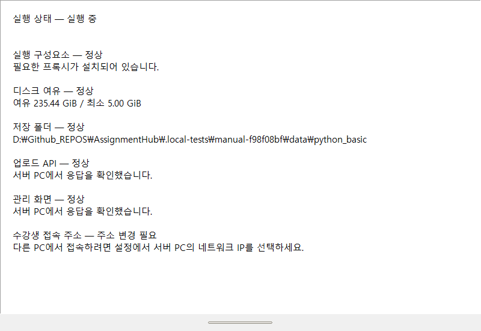

### 로그인·전송 문제의 확인 순서

1. **로그인 실패**: 과정 주소, ID의 0과 대소문자를 확인합니다. 비밀번호를 잊었으면 관리자에게 초기화를 요청합니다.
2. **이어 올리기 불가**: 같은 계정과 원본 파일인지 확인합니다. 취소하거나 기본 24시간 보관 기간이 지난 작업은 새로 제출합니다.
3. **창이 좁은 경우**: 메뉴가 접혀 있으면 왼쪽 위에서 펼칩니다. 이어 올리기와 저장 공간은 아래로 스크롤하고, 표는 표 안에서 가로 이동합니다.
4. **실행 파일 오류**: 배포 ZIP 전체를 새 폴더에 다시 풉니다. setup.bat와 logs/manager-startup.log로 오류 내용을 확인합니다.

> 문의할 때 과정명·ID·제출번호·오류 문구를 전달합니다. 비밀번호나 연결 코드는 보내지 마세요.

**완료 확인:** 문제가 서버 실행, 주소·네트워크, 계정, 원본 파일 또는 공간 중 어디에 있는지 확인하고 필요한 조치를 안내합니다.
