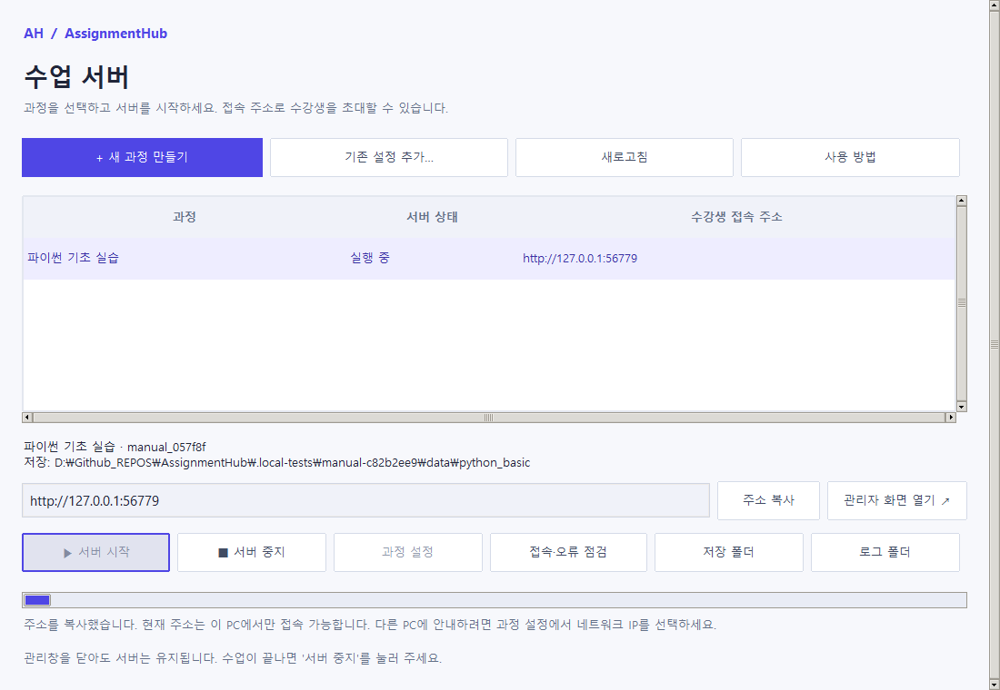

# 서버 관리창 사용 안내

Windows 10/11 x64 운영자 PC에 배포 ZIP 전체를 압축 해제하고 `start.bat`를 더블클릭합니다. Python 3.12, Tcl/Tk와 모든 관련 라이브러리가 동봉되어 있어 별도 설치와 인터넷 다운로드가 필요하지 않습니다. 구성요소 점검 후 한국어 관리창이 열립니다. 오류가 있으면 콘솔을 닫지 않고 원인을 표시합니다. 배포 파일 손상 여부는 `setup.bat`로 점검할 수 있습니다. 일상적인 서버 운영에 명령어를 입력할 필요가 없습니다.

관리창은 최소 640 × 520, 과정 설정 창은 최소 540 × 480까지 줄일 수 있습니다. 좁은 관리창에서는 버튼을 두 줄로 배치하고 주소를 별도 줄에 표시합니다. 높이가 부족하면 오른쪽 스크롤바 또는 마우스 휠로 이동하세요. 설정 입력란은 Tab 키로 이동해도 자동으로 화면에 들어옵니다. 과정 목록의 긴 주소는 목록 아래 가로 스크롤바로 확인할 수 있습니다. [작은 관리창 예시](manual/screenshots/22-manager-compact.png)

## 처음 과정을 만들 때

상단의 **기본 정보**와 **용량·전송 설정** 탭은 선택 여부와 관계없이 높이와 여백이 같습니다. 현재 탭은 연보라색 배경과 진한 글자색으로 구분합니다. 탭을 바꿔도 탭 제목의 위아래 위치가 움직이지 않습니다. [용량 설정 화면](manual/screenshots/03-course-limits.png)

**새 과정 만들기**에서 과정명, 안내 IP, 관리자 ID와 비밀번호를 입력합니다. 비밀번호는 8~128자이며 확인란과 같아야 합니다. 평문 비밀번호는 설정 파일에 저장하지 않습니다.

과정 ID와 포트는 기존 과정과 겹치지 않는 값으로 제안합니다. 실제 시작 시 포트 사용 여부를 다시 확인합니다. 네트워크 IP는 이 PC의 활성 IPv4 인터페이스에서 읽으며 외부 주소 조회 서비스를 사용하지 않습니다. VPN·유선·무선 주소가 함께 나타날 수 있으므로 교육장 네트워크 주소를 선택합니다. 호스트명을 직접 입력할 수도 있습니다. 네트워크가 없을 때 표시하는 `127.0.0.1`은 이 PC에서만 접속할 수 있습니다.

저장 폴더 기본값은 저장소의 `data/<과정 ID>/`입니다. 다른 볼륨의 비어 있는 폴더를 선택할 수 있습니다. 기존 파일이 들어 있는 폴더에 새 과정을 덮어쓰지 않습니다. 용량·전송 설정 탭의 기본값으로 바로 사용할 수 있으며 `0.5 GiB`처럼 입력할 수 있습니다. 바이트를 직접 계산할 필요는 없습니다.

**과정 만들기** 후 목록에서 **서버 시작**을 누릅니다. 시작이 완료되어 '실행 중'으로 바뀌면 **관리자 화면 열기**를 누르고 관리자 계정으로 로그인합니다. 운영 안내에서 명단 등록 → 과제 접수 확인 → 접속 주소 안내를 진행합니다.

## 매 수업의 시작과 종료

- 관리창에서 과정을 선택하고 **서버 시작**을 누릅니다. 서버를 준비하는 동안 버튼 아래 진행 막대가 움직이고 작업명과 경과 시간을 표시합니다. 준비가 끝나면 막대가 사라지고 **서버가 준비됐습니다**라는 안내가 남습니다.
- **주소 복사**로 수강생에게 URL을 전달합니다. 같은 PC에서 응답한다고 다른 PC의 방화벽까지 통과한 것은 아니므로 교육장 수강생 PC에서 실제 접속을 확인합니다.
- **서버 중지**는 선택한 과정만 중지합니다. 전송 중인 사용자에게 미리 안내합니다. 완료 제출은 보존하고 유효한 미완료 작업은 재시작 후 이어 올릴 수 있습니다.
- **관리창을 닫는 것과 서버를 중지하는 것은 별개**입니다. 실행 중인 서버가 있으면 닫을 때 확인 안내를 보여 줍니다. 관리창을 다시 열면 현재 상태를 조회할 수 있습니다.

진행 막대는 작업 중임을 나타냅니다. 완료율이나 남은 시간을 계산하지 않습니다. 시작·중지·설정 저장·직접 새로고침 등 요청한 작업이 끝나거나 실패하면 표시를 멈추고 숨깁니다. 5초마다 수행하는 자동 상태 확인은 진행 막대를 켜거나 완료 안내를 덮어쓰지 않습니다. 여러 차수의 작업을 함께 실행하면 진행 중인 작업 수를 표시하며, 마지막 요청 작업이 끝날 때 막대가 사라집니다.

## 기존 과정과 설정 변경

`instances/`의 JSON 설정은 자동으로 목록에 나타납니다. 다른 위치의 설정은 **기존 설정 추가**로 연결합니다. 연결한 경로는 `instances/.manager-paths.json`에 보관합니다. 같은 과정 ID·저장 폴더·포트를 중복 등록하지 않습니다. 잘못된 개별 설정은 오류 행으로 표시하며 다른 과정의 관리 기능을 계속 사용할 수 있습니다.

과정 설정을 변경하려면 먼저 해당 서버를 중지합니다. 과정명·안내 IP·포트·용량·동시성·보관 시간을 변경할 수 있습니다. 기존 과정 ID·저장 위치·인증 비밀값과 계정은 보존합니다. TLS 인증서, 바인딩 주소 등 고급 설정은 기존 CLI/JSON 설정을 사용합니다. 값을 낮춰도 이전 제출 파일을 삭제하지 않으며 이후 제출에 적용되는 한도가 바뀝니다.

## 접속이 안 되거나 시작에 실패할 때

**접속·오류 점검**은 선택한 과정의 실행 상태, 프록시 설치, 저장 폴더 식별 정보, 디스크 여유, 접속 포트, 로컬 API·관리 화면 응답을 확인합니다. 실행 중인 과정의 포트를 단순히 충돌로 표시하지 않습니다. 설정의 주소가 localhost라면 다른 PC용 IP로 변경하도록 안내합니다. HTTPS 인증서 검증은 끄지 않습니다.

점검 결과에 따라 공간을 확보하거나 포트를 변경하고 **로그 폴더**에서 상세 실행 로그를 확인합니다. 방화벽이나 네트워크 보안 설정은 자동 변경하지 않습니다. 다른 PC의 LAN 접속과 기관 인증서 신뢰는 실제 운영 환경에서 확인해야 합니다.

## 백업과 저장 위치

**서버 중지** 후 상태를 확인하고 설정 JSON과 **저장 폴더 전체**를 함께 복사합니다. 기본 저장 폴더는 Git 제외 대상입니다. 자세한 복원·비밀값·DB 보존 절차는 [관리자 운영 안내](admin-guide.md)를 따릅니다.

## 이번 변경의 검증

검증 결과와 미검증 범위는 [검증 보고서의 서버 사용성 개선 항목](test-report.md#서버-사용성-개선-후속-검증)과 [v1.3.1 진행 표시 검증](v1.3.1-test-report.md)을 확인하세요. Tk 위젯 콜백 호출과 실제 프로세스·브라우저 테스트는 OS 마우스 입력 자동화와 구분합니다.
