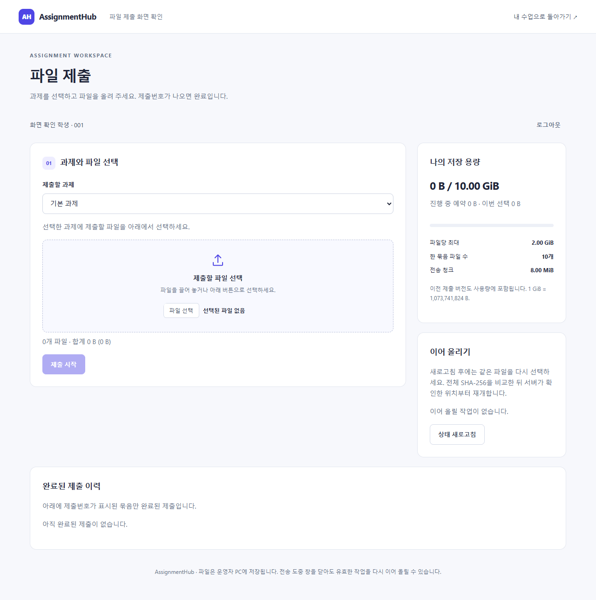

# v1.3.2 파일 제출 화면 초기화 검증

2026-09-08, Windows x64 / Python 3.12 / Edge 152.0.4191.66에서 확인했습니다.

## 증상과 재현

사용자가 보고한 증상은 파일 제출 제목과 안내 문구는 보이지만 과제·파일 선택 영역이 통째로 보이지 않는 상태입니다. v1.3.1의 기본 환경에서는 정상 화면을 확인했습니다. 같은 배포본에서 JavaScript 응답을 `text/plain`으로 바꾸면 브라우저가 실행을 거부하면서 보고된 형태의 빈 영역이 재현됐습니다.

API의 정적 파일 응답은 Python의 MIME 형식 추론을 사용했고, 이 추론에는 Windows 파일 형식 설정이 반영됩니다. 프로세스 안에서 `.js`를 `text/plain`, `.css`를 `application/octet-stream`으로 지정하자 기존 API가 해당 형식을 그대로 반환했습니다. 새 회귀 검사 5개가 수정 전 실패하고 수정 후 통과했습니다. 실제 사용자 PC의 파일 형식 설정을 직접 확인한 결과는 아니며, 재현된 원인과 화면 초기화 실패 처리를 수정한 것입니다.

## 수정 내용

- 업로더의 JavaScript·해시 작업 스크립트는 `text/javascript`, CSS는 `text/css`로 고정해 전달합니다. CSP와 `nosniff` 보호는 유지합니다.
- 스크립트 실행 전에도 로딩 안내와 다시 여는 방법을 HTML에 표시합니다. JavaScript를 끈 브라우저에는 별도 안내가 보입니다.
- 화면 데이터 조회에는 15초 제한을 적용합니다. 파일 전송·검증·제출 확정 요청의 시간 제한은 변경하지 않았습니다.
- 초기 데이터 조회나 로그인 정보 해석에 실패하면 오류 안내와 로그인 화면을 표시합니다. 재로그인 중 조회가 실패해도 다시 시도할 수 있습니다.

## 검증 결과

`python -m pytest tests/test_api.py -q`: **25개 통과**. 잘못된 OS 파일 형식 설정에 대한 정적 리소스 응답, 로그인, 직접 제출, 파일 전송과 다운로드 관련 검사를 포함합니다.

`python scripts/check_upload_boot.py`: 실제 로컬 서버와 Edge에서 **6개 시나리오 통과**.

| 시나리오 | 확인 내용 |
| --- | --- |
| 정상 제출 | 실제 수업 화면의 버튼으로 제출 창 열기, 과제·파일 선택·용량·이력 표시, 파일 선택 후 제출 시작 활성화, 해시 작업과 제출번호 발급 |
| 화면 스크립트 차단 | 파일 선택 영역 대신 로딩 안내와 다시 여는 방법 표시 |
| 서버 정보 응답 지연 | 15초 뒤 시간 초과와 로그인 표시, 응답 복구 후 재로그인으로 파일 선택 화면 진입 |
| 저장 용량 조회 실패 | 초기 조회 및 재로그인 중 실패 모두 안내 유지, 복구 후 재시도 성공 |
| 로그인 데이터 해석 실패 | 오류 표시, 데이터 요소 제거, 재로그인으로 복구 |
| JavaScript 비활성화 | 스크립트 허용 방법 안내 |

과정과 계정은 검증 전용으로 생성했습니다. 응답 지연·차단·잘못된 로그인 데이터는 브라우저 요청 제어로 재현했습니다. 운영 중인 사용자 데이터와 서버는 사용하지 않았습니다.

## 화면과 배포

[스크립트가 로드되지 않을 때의 안내](evidence/uploader-v132-loading.png) · [조회 시간 초과 후 복구 안내](evidence/uploader-v132-timeout.png)

이번 무설치 ZIP의 실행 검사 결과와 SHA-256은 [v1.3.2 릴리즈](https://github.com/prozac0401/AssignmentHub/releases/tag/v1.3.2)에 기록합니다. 기존 v1.3.0 개정 매뉴얼·퀵가이드도 함께 제공합니다.
